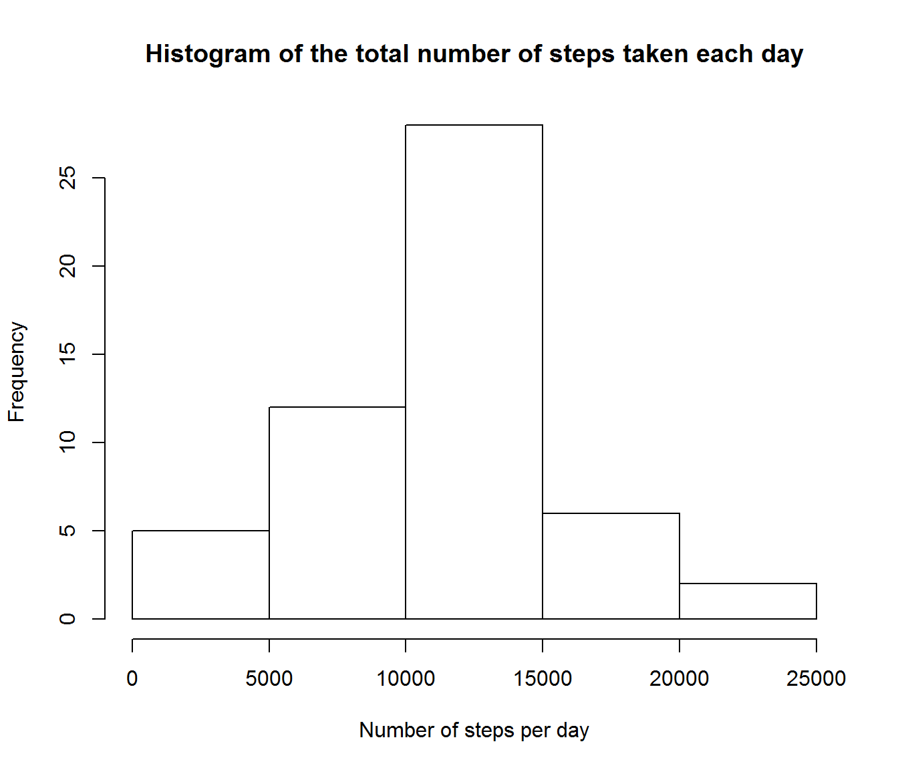
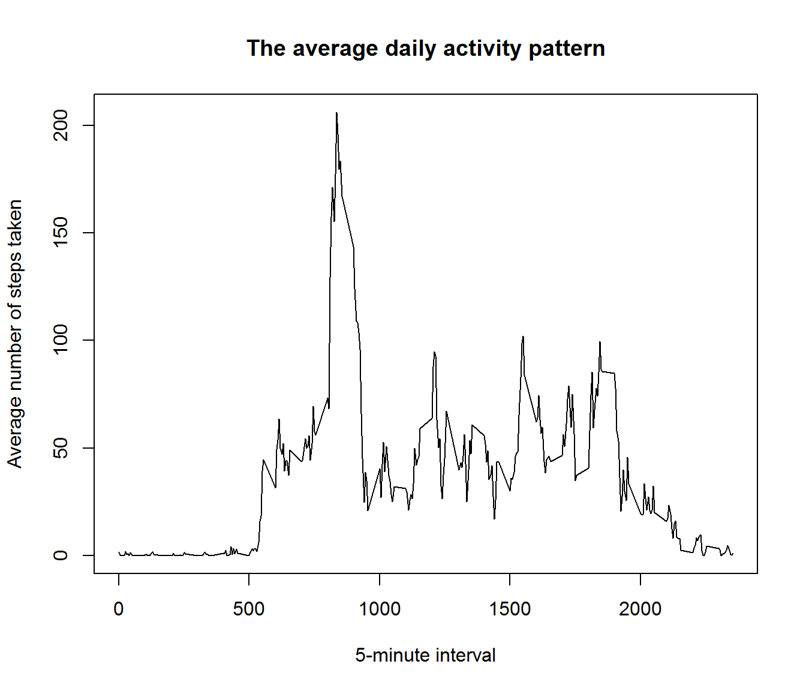
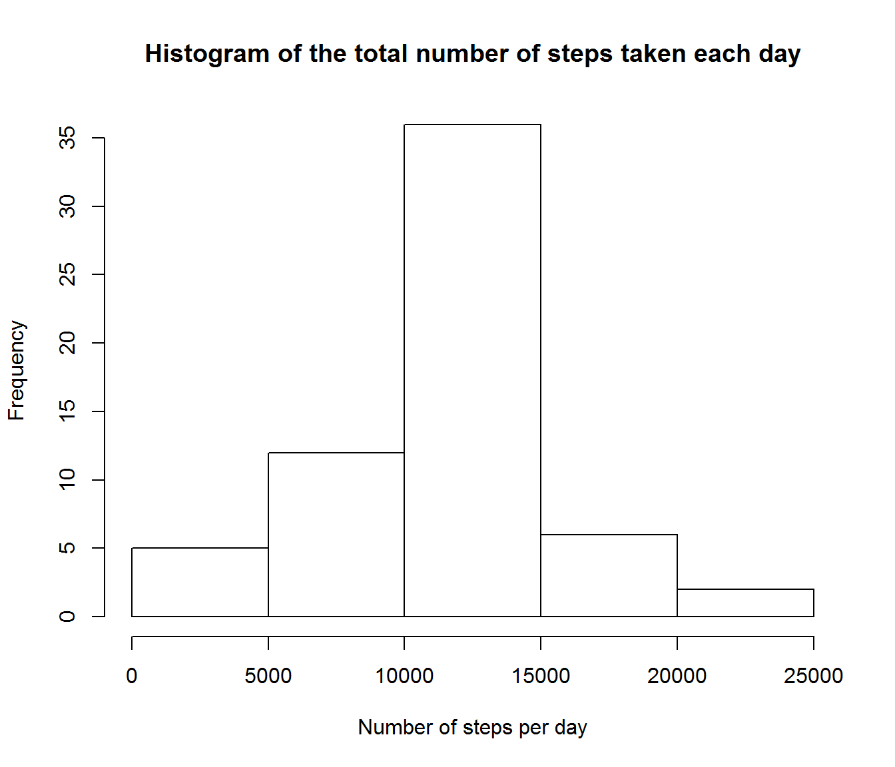
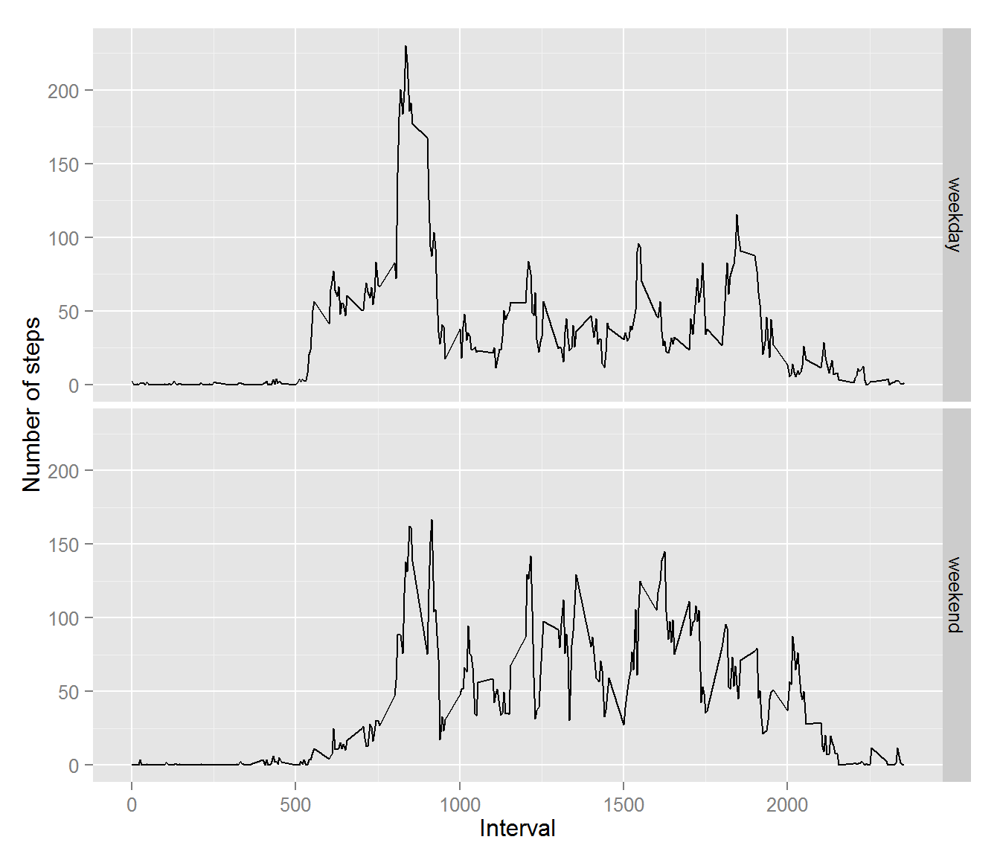

Reproducible Research: Peer Assessment 1
========================================

This assesment is part of the Coursera *Reproducible Research* course


## Loading and preprocessing the data
Unzip the data (if not) and read it in variable *data*


```r
if (!file.exists("activity.csv")) {
  unzip("activity.zip")
}

data <- read.csv("activity.csv")
```


## What is mean total number of steps taken per day?

Let's make a histogram for total steps:


```r
day_data <- with(data, tapply(steps, date, sum)) # Sum the steps per day

# Plot histogram
hist(day_data, 
     xlab="Number of steps per day",
     main="Histogram of the total number of steps taken each day")
```

 

And calculate the mean and the median:

```r
# Calculate the mean and the median
mean_data <- mean(day_data, na.rm=TRUE)
median_data <- median(day_data, na.rm=TRUE)
```
Mean is: 1.0766189 &times; 10<sup>4</sup>
 
Median is: 10765

## What is the average daily activity pattern?


```r
interval_data <- with(data, tapply(steps, interval, mean, na.rm=TRUE)) # Mean per interval

# Make plot
plot(names(interval_data),interval_data, 
     type="l",
     xlab="5-minute interval",
     ylab="Average number of steps taken",
     main="The average daily activity pattern")
```

 


```r
# Find the max 5-minute interval
interval_max <- max(interval_data)
interval_max_name <- names(which(interval_data==max(interval_data)))
```

The maximum interval is 835 with 206.1698113 steps.

## Imputing missing values

Number of NA-rows:


```r
number_of_NA <- length(which(is.na(data$steps))) # Number of NA
```
Number of missing data: 2304
 
Fill the missing values with the average value of the 5-minute time interval


```r
data_NA_fill <- data # Make copy of orginal data

list_of_NA <- data_NA_fill[is.na(data_NA_fill[,1]),3] # Pick list of rows with NA and take 
                                                      # their interval number
  
data_NA_fill[is.na(data_NA_fill[,1]),1] <-            # Fill the NA values whith
interval_data[match(list_of_NA,names(interval_data))] # the average value according to the interval number
```

Make a new histogram with NA-filled data

```r
day_data_NA_fill <- with(data_NA_fill, tapply(steps, date, sum)) # Sum the steps per day

# Plot histogram
hist(day_data_NA_fill, 
     xlab="Number of steps per day",
     main="Histogram of the total number of steps taken each day")
```

 


And calculate the new mean and the new median:

```r
# Calculate the mean and the median
mean_data_NA_fill <- mean(day_data_NA_fill, na.rm=TRUE)
median_data_NA_fill <- median(day_data_NA_fill, na.rm=TRUE)
```
New mean is: 1.0766189 &times; 10<sup>4</sup>. (Difference to old: 0)
 
New median is: 1.0766189 &times; 10<sup>4</sup>. (Difference to old: 1.1886792)

## Are there differences in activity patterns between weekdays and weekends?

Format data to suitable form:


```r
# Make date variable to Date object
data_NA_fill$date <- as.Date(data_NA_fill$date, "%Y-%m-%d") 

# Change system locale to english
Sys.setlocale("LC_TIME", "English")

# Make list of weekday and weekend days
w_days <- c("Monday","Tuesday","Wednesday","Thursday","Friday")
w_ends <- c("Saturday","Sunday")


data_NA_fill$weekd <- NA # New variable

data_NA_fill[weekdays(data_NA_fill$date) %in% w_days,4] <- "weekday" # Input weekdays
data_NA_fill[weekdays(data_NA_fill$date) %in% w_ends,4] <- "weekend" # Input weekends

data_NA_fill$weekd <- as.factor(data_NA_fill$weekd) # Change to factor
```

Make plot


```r
weekdays_data <- aggregate(steps ~ interval + weekd, data=data_NA_fill, mean) # Aggregate data

library(ggplot2) # Use ggplot

# Plot
ggplot(weekdays_data, aes(interval, steps)) + 
  geom_line() + 
  facet_grid(weekd ~ .) +
  xlab("Interval") + 
  ylab("Number of steps")
```

 
